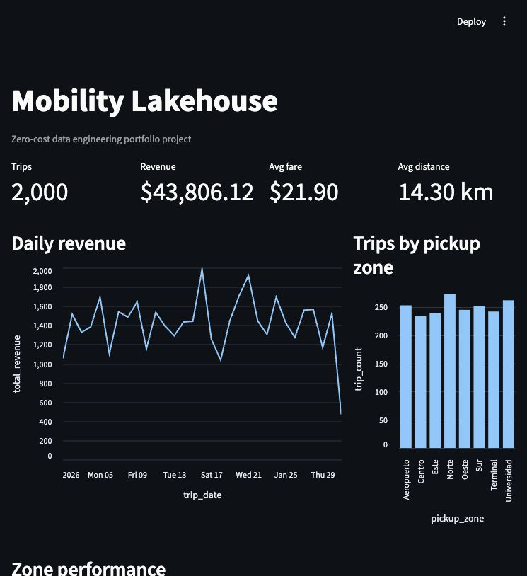

# Mobility Lakehouse Portfolio



A zero-cost data engineering portfolio project that builds a local analytics lakehouse for urban mobility data using Python, DuckDB, SQL and Streamlit.

The project turns reproducible trip data into analytics-ready metrics through bronze, silver and gold layers, then exposes the results in a local dashboard.

## What This Project Demonstrates

- End-to-end data pipeline design
- Bronze, silver and gold data modeling
- SQL-based analytical transformations
- Local warehouse development with DuckDB
- Data quality testing with pytest
- CI automation with GitHub Actions
- Lightweight dashboarding with Streamlit

## Features

- Reproducible ingestion into a `bronze` layer.
- SQL transformations into `silver` and `gold` tables.
- Local analytical warehouse with DuckDB.
- Data quality tests with `pytest`.
- Local dashboard with Streamlit.
- Free CI with GitHub Actions.
- Documentation for technical reviewers and recruiters.

## Architecture

```text
Synthetic/public data
        |
        v
data/bronze/*.csv
        |
        v
DuckDB warehouse
        |
        +--> silver_trips
        +--> gold_daily_metrics
        +--> gold_zone_metrics
        +--> Streamlit dashboard
```

The project works offline by generating synthetic data. This avoids costs, credentials and paid API dependencies. It can later be extended with public datasets such as NYC TLC Trip Record Data, OpenStreetMap or city open data portals.

## Stack

- Python
- DuckDB
- Pandas
- Streamlit
- Pytest
- Ruff
- GitHub Actions

Everything runs locally. The project does not require AWS, GCP, Azure, Snowflake, Databricks or any paid service.

## Quickstart

```bash
python -m venv .venv
source .venv/bin/activate
pip install -e ".[dev]"
make pipeline
make test
make dashboard
```

The pipeline creates:

- `data/bronze/trips.csv`
- `data/warehouse.duckdb`
- analytical tables inside DuckDB

To inspect results from the terminal:

```bash
python -m mobility_lakehouse.query
```

To open the dashboard:

```bash
make dashboard
```

Then visit:

```text
http://localhost:8501
```

## Commands

```bash
make generate     # generate sample data
make transform    # build silver/gold tables in DuckDB
make pipeline     # generate + transform
make dashboard    # open the local dashboard
make test         # run tests
make lint         # run ruff
make clean        # remove generated artifacts
```

## Data Model

### `silver_trips`

Clean trip-level table.

Main fields:

- `trip_id`
- `pickup_ts`
- `dropoff_ts`
- `pickup_zone`
- `dropoff_zone`
- `passenger_count`
- `distance_km`
- `fare_amount`
- `tip_amount`
- `total_amount`
- `duration_minutes`

### `gold_daily_metrics`

Daily aggregated metrics:

- trip count
- total revenue
- average distance
- average fare
- average tip rate

### `gold_zone_metrics`

Pickup-zone aggregated metrics:

- trip count
- total revenue
- average distance
- average duration

## Data Quality

The tests validate that:

- the pipeline creates the expected tables
- trip IDs are unique
- monetary amounts are not negative
- trip durations are positive
- gold tables contain data
